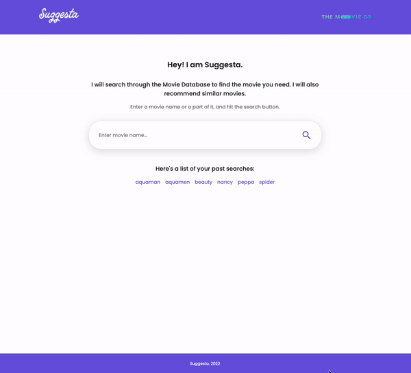

# Suggesta - Progressive Web App

###  :clapper: Suggesta is a progressive web app that searches for movies based on a user's input using The Movie Database API. The app is installable and works offline while going through past searches. The searches data is stored in the IDB and the movie posters are stored in dynamic cache.

1. Enter a movie name or a keyword and hit "Enter"
2. Click a movie card to see similar movies 
3. Click a movie card again to see more similar movies

You can use a list of past searches to navigate the app, while being offline. 

## [DEMO](https://pages.github.com/) :arrow_right:

